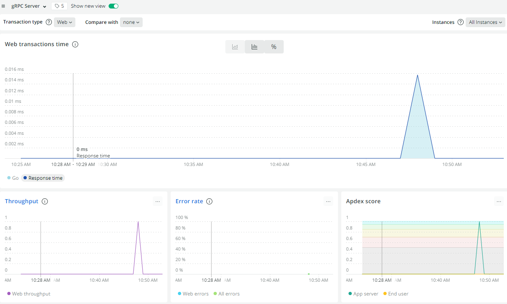

# NewRelic gRPC APM in Golang

- init

```
go mod init newrelic-go-grpc
```

- get modules

```
go get -u \
  google.golang.org/grpc \
  google.golang.org/protobuf/proto \
  github.com/golang/protobuf/proto \
  github.com/grpc-ecosystem/go-grpc-middleware \
  github.com/newrelic/go-agent \
  github.com/newrelic/go-agent/_integrations/nrgrpc
```

- run server

```
NEW_RELIC_LICENSE_KEY=<your-license-key> go run server/main.go
```

- grpcurl

```
grpcurl \
  -plaintext \
  -import-path proto \
  -proto helloworld.proto \
  localhost:50051 helloworld.Greeter/SayHello
```

- check NewRelic dashboard


